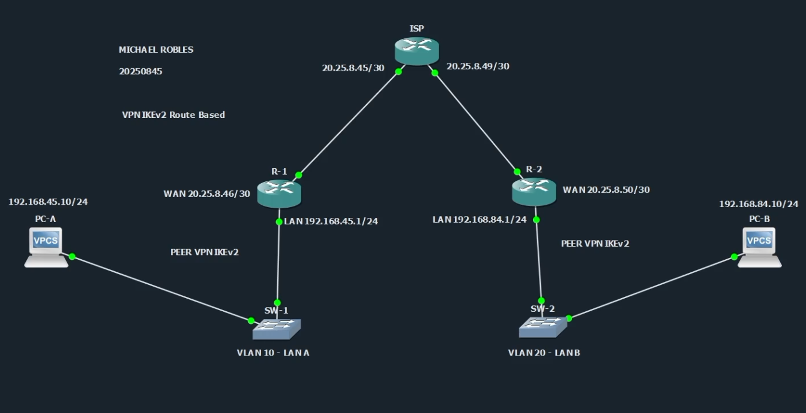
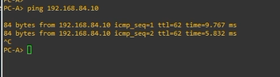
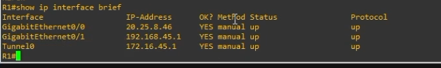
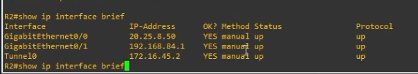
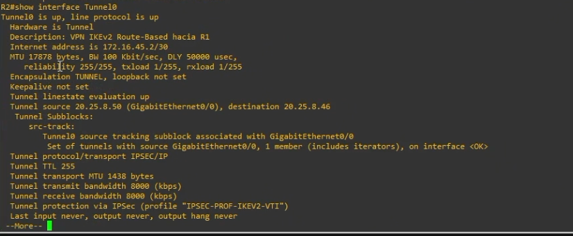
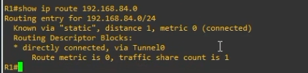
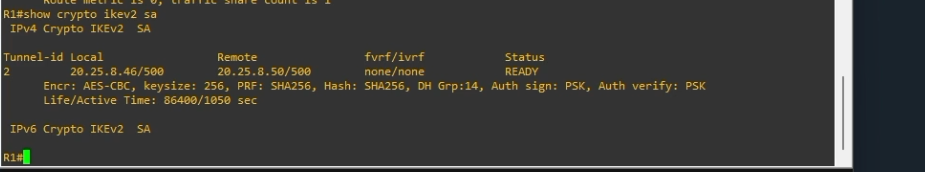
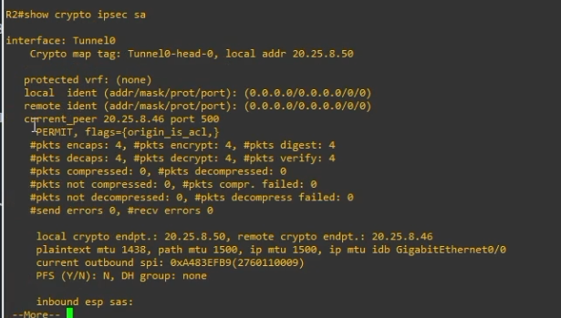

# VPN IPSec IKEv2 Route-Based - Site-to-Site Punto a Punto

<p align="center">
  
  
  
  
  
  
  
</p>

<p align="center">
  <a href="https://github.com/iClexi/VPN-IKEv2-Route-Based">
    
  </a>
  <a href="https://youtu.be/UEmW42-w2ys">
    
  </a>
  <a href="Docs/Documentacion%20Tecnica%20Profesional.pdf">
    
  </a>
</p>


---

**Estudiante:** Michael Robles  
**Matrícula:** 20250845  
**Asignatura:** Seguridad de Redes  
**Práctica:** P3  
**Tipo de VPN:** IPSec IKEv2 Site-to-Site Route-Based  
**Repositorio:** https://github.com/iClexi/VPN-IKEv2-Route-Based  
**Video demostrativo:** https://youtu.be/UEmW42-w2ys  
**Documentación técnica profesional:** [docs/Documentacion Tecnica Profesional.pdf](docs/Documentacion%20Tecnica%20Profesional.pdf)

---

## 1. Objetivo del laboratorio

El objetivo de este laboratorio es configurar una **VPN site-to-site punto a punto basada en enrutamiento** usando **IKEv2 e IPSec**. Esta VPN permite que la LAN A `192.168.45.0/24` y la LAN B `192.168.84.0/24` se comuniquen de forma segura a través del ISP.

A diferencia de una VPN policy-based, esta VPN no usa una ACL como tráfico interesante ni un crypto map aplicado directamente en la interfaz WAN. En este caso se crea una interfaz virtual `Tunnel0`, se protege con IPSec y luego se agregan rutas estáticas para enviar las redes remotas por el túnel.

---

## 2. Topología utilizada



La topología está formada por dos sitios conectados a través de un router ISP:

```text
PC-A --- SW1 --- R1 --- ISP --- R2 --- SW2 --- PC-B
```

R1 representa el sitio A y R2 representa el sitio B. El túnel VPN se establece entre las IP WAN de R1 y R2.

---

## 3. Tabla de direccionamiento

| Dispositivo | Interfaz | Dirección IP | Descripción |
|---|---:|---:|---|
| PC-A | NIC | 192.168.45.10/24 | Equipo final de LAN A |
| R1 | G0/1 | 192.168.45.1/24 | Gateway de LAN A |
| R1 | G0/0 | 20.25.8.46/30 | WAN hacia ISP |
| ISP | G0/0 | 20.25.8.45/30 | Enlace hacia R1 |
| ISP | G0/1 | 20.25.8.49/30 | Enlace hacia R2 |
| R2 | G0/0 | 20.25.8.50/30 | WAN hacia ISP |
| R2 | G0/1 | 192.168.84.1/24 | Gateway de LAN B |
| PC-B | NIC | 192.168.84.10/24 | Equipo final de LAN B |
| R1 | Tunnel0 | 172.16.45.1/30 | Extremo local del túnel |
| R2 | Tunnel0 | 172.16.45.2/30 | Extremo remoto del túnel |

---

## 4. Estructura del repositorio

```text
VPN-IKEv2-Route-Based/
├── README.md
├── Docs/
│   └── Documentacion Tecnica Profesional.pdf
├── configs/
│   ├── ISP.cfg
│   ├── R1.cfg
│   ├── R2.cfg
│   ├── SW1.cfg
│   └── SW2.cfg
└── images/
    ├── 01_topologia_route_based.png
    ├── 02_ping_pca_pcb.png
    ├── 03_r1_show_ip_interface_brief.png
    ├── 04_r2_show_ip_interface_brief.png
    ├── 05_r2_show_interface_tunnel0.png
    ├── 06_r1_show_ip_route_remote_lan.png
    ├── 07_r1_show_crypto_ikev2_sa.png
    └── 08_r2_show_crypto_ipsec_sa.png
```

La carpeta `Docs/` contiene la documentación técnica profesional en PDF. La carpeta `configs/` contiene los scripts completos por dispositivo. La carpeta `images/` contiene las evidencias usadas en este README.

---

## 5. Configuración base de los equipos finales

En **PC-A** se configuró la IP de la LAN A:

```bash
ip 192.168.45.10/24 192.168.45.1
save
```

En **PC-B** se configuró la IP de la LAN B:

```bash
ip 192.168.84.10/24 192.168.84.1
save
```

Estas IPs permiten que cada PC use su router local como gateway.

---

## 6. Configuración de switches

En **SW1** se creó la VLAN 10 para la LAN A y se dejaron los puertos hacia R1 y PC-A en modo access.

```cisco
vlan 10
 name LAN_A

interface gigabitEthernet0/0
 switchport mode access
 switchport access vlan 10

interface gigabitEthernet0/1
 switchport mode access
 switchport access vlan 10
 spanning-tree portfast
```

En **SW2** se creó la VLAN 20 para la LAN B.

```cisco
vlan 20
 name LAN_B

interface gigabitEthernet0/0
 switchport mode access
 switchport access vlan 20

interface gigabitEthernet0/1
 switchport mode access
 switchport access vlan 20
 spanning-tree portfast
```

Para ver las configuraciones completas, revisar `configs/SW1.cfg` y `configs/SW2.cfg`.

---

## 7. Configuración del ISP

El ISP solamente tiene conectividad entre R1 y R2. No se configuraron rutas hacia las LAN internas, porque la comunicación entre `192.168.45.0/24` y `192.168.84.0/24` debe depender de la VPN.

```cisco
interface gigabitEthernet0/0
 ip address 20.25.8.45 255.255.255.252
 no shutdown

interface gigabitEthernet0/1
 ip address 20.25.8.49 255.255.255.252
 no shutdown
```

Para ver el script completo, revisar `configs/ISP.cfg`.

---

## 8. Configuración principal de R1

R1 tiene una interfaz WAN hacia el ISP y una interfaz LAN hacia SW1.

```cisco
interface gigabitEthernet0/0
 description WAN hacia ISP
 ip address 20.25.8.46 255.255.255.252
 no shutdown

interface gigabitEthernet0/1
 description LAN A hacia SW1
 ip address 192.168.45.1 255.255.255.0
 no shutdown
```

También se configuró una ruta por defecto hacia el ISP:

```cisco
ip route 0.0.0.0 0.0.0.0 20.25.8.45
```

Esta ruta permite que R1 alcance la IP WAN de R2 `20.25.8.50`.

---

## 9. Configuración IKEv2 en R1

El bloque IKEv2 se encarga de negociar la seguridad de la VPN.

```cisco
crypto ikev2 proposal PROP-IKEV2-VTI
 encryption aes-cbc-256
 integrity sha256
 group 14
```

La proposal define los algoritmos de seguridad. `aes-cbc-256` se usa para cifrado, `sha256` para integridad y `group 14` para Diffie-Hellman.

```cisco
crypto ikev2 policy POL-IKEV2-VTI
 proposal PROP-IKEV2-VTI
```

La policy indica que se usará la proposal anterior durante la negociación.

```cisco
crypto ikev2 keyring KR-IKEV2-VTI
 peer R2
  address 20.25.8.50
  pre-shared-key local ITLA20250845
  pre-shared-key remote ITLA20250845
```

El keyring define el peer remoto, que en R1 es R2, y la clave precompartida usada para autenticación.

```cisco
crypto ikev2 profile PROF-IKEV2-VTI
 match identity remote address 20.25.8.50 255.255.255.255
 authentication remote pre-share
 authentication local pre-share
 keyring local KR-IKEV2-VTI
```

El profile une la autenticación con el keyring y permite reconocer al peer remoto por su IP WAN.

---

## 10. Configuración IPSec y Tunnel0 en R1

El transform-set define cómo IPSec protegerá el tráfico real:

```cisco
crypto ipsec transform-set TS-IKEV2-VTI esp-aes 256 esp-sha-hmac
 mode tunnel
```

Luego se crea un perfil IPSec que une el transform-set con el perfil IKEv2:

```cisco
crypto ipsec profile IPSEC-PROF-IKEV2-VTI
 set transform-set TS-IKEV2-VTI
 set ikev2-profile PROF-IKEV2-VTI
```

Finalmente se crea la interfaz virtual `Tunnel0`:

```cisco
interface Tunnel0
 description VPN IKEv2 Route-Based hacia R2
 ip address 172.16.45.1 255.255.255.252
 tunnel source gigabitEthernet0/0
 tunnel destination 20.25.8.50
 tunnel mode ipsec ipv4
 tunnel protection ipsec profile IPSEC-PROF-IKEV2-VTI
 no shutdown
```

Esta interfaz representa el túnel VPN entre R1 y R2. Al aplicar `tunnel protection ipsec profile`, todo el tráfico que cruce por `Tunnel0` queda protegido con IPSec.

La ruta hacia la LAN B se configuró así:

```cisco
ip route 192.168.84.0 255.255.255.0 Tunnel0
```

Esa línea es la clave de una VPN Route-Based: la tabla de rutas decide que el tráfico hacia la red remota debe salir por el túnel.

Para ver el script completo, revisar `configs/R1.cfg`.

---

## 11. Configuración principal de R2

R2 usa la misma lógica que R1, pero invertida. Su peer remoto es R1 y su ruta remota apunta hacia la LAN A.

```cisco
interface Tunnel0
 description VPN IKEv2 Route-Based hacia R1
 ip address 172.16.45.2 255.255.255.252
 tunnel source gigabitEthernet0/0
 tunnel destination 20.25.8.46
 tunnel mode ipsec ipv4
 tunnel protection ipsec profile IPSEC-PROF-IKEV2-VTI
 no shutdown

ip route 192.168.45.0 255.255.255.0 Tunnel0
```

Para ver el script completo, revisar `configs/R2.cfg`.

---

## 12. Verificación de funcionamiento

Primero se generó tráfico desde PC-A hacia PC-B.

```bash
ping 192.168.84.10
```



El ping exitoso demuestra que la LAN A puede comunicarse con la LAN B.

---

### Verificación de interfaces en R1

```cisco
show ip interface brief
```



En R1 se observa que `Tunnel0` tiene la IP `172.16.45.1` y está en estado `up/up`.

---

### Verificación de interfaces en R2

```cisco
show ip interface brief
```



En R2 se observa que `Tunnel0` tiene la IP `172.16.45.2` y también está en estado `up/up`.

---

### Verificación de Tunnel0

```cisco
show interface Tunnel0
```



Este comando confirma que el túnel está arriba y que la protección IPSec está aplicada con el perfil `IPSEC-PROF-IKEV2-VTI`.

---

### Verificación de ruta remota

```cisco
show ip route 192.168.84.0
```



La ruta hacia `192.168.84.0/24` aparece por `Tunnel0`, demostrando que el tráfico hacia LAN B entra por la VPN.

---

### Verificación de IKEv2

```cisco
show crypto ikev2 sa
```



El estado `READY` confirma que IKEv2 negoció correctamente entre R1 y R2.

---

### Verificación de IPSec

```cisco
show crypto ipsec sa
```



Este comando confirma que IPSec está cifrando y descifrando tráfico. Los contadores `encaps`, `encrypt`, `decaps` y `decrypt` aumentan cuando se genera tráfico entre PC-A y PC-B.

---

## 13. Comandos principales de verificación

En R1:

```cisco
show ip interface brief
show interface Tunnel0
show ip route 192.168.84.0
show crypto ikev2 sa
show crypto ipsec sa
show crypto session
show tunnel protection
```

En R2:

```cisco
show ip interface brief
show interface Tunnel0
show ip route 192.168.45.0
show crypto ikev2 sa
show crypto ipsec sa
show crypto session
show tunnel protection
```

---

## 14. Conclusión

La VPN IKEv2 Route-Based quedó funcionando correctamente. Se comprobó que PC-A puede alcanzar a PC-B, que las interfaces `Tunnel0` están activas, que las rutas hacia las redes remotas apuntan por el túnel, que IKEv2 aparece en estado `READY` y que IPSec muestra paquetes cifrados y descifrados.

Este modelo de VPN es más flexible que una VPN policy-based porque el tráfico se controla con rutas, permitiendo manejar la VPN como si fuera un enlace lógico entre routers.
